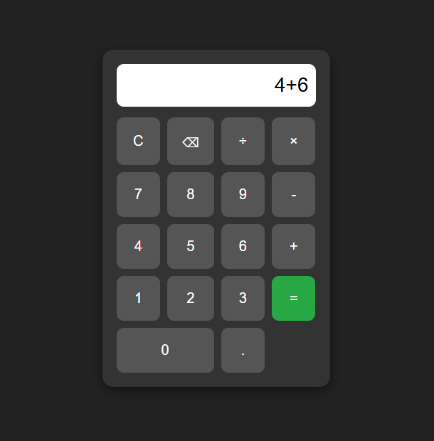

# Simple Calculator

A modern calculator built using HTML, CSS, and JavaScript.

## Live Demo

(https://zytrix-tech05.github.io/Calculator-App/.)

## ✨ Features

- Addition
- Subtraction
- Multiplication
- Division
- Decimal calculations
- Clear button
- Delete button
- Responsive design

## Technologies Used

- HTML5
- CSS3
- JavaScript

## Screenshot

## Project Structure

Calculator-App/

├── index.html

├── style.css

├── script.js

└── README.md

## Author

Ohene Richmond Kwasi

GitHub: https://github.com/Zytrix-Tech05
